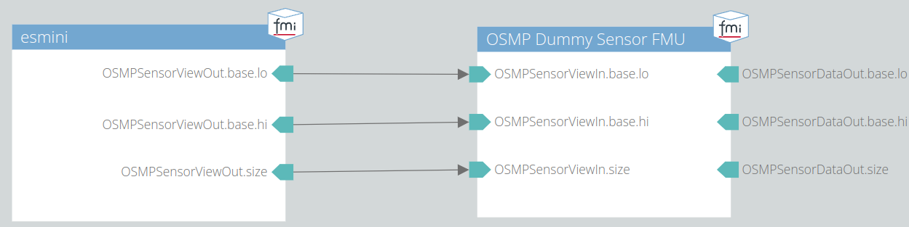

## esmini OSMP FMU

This example compiles an [OSMP FMU](https://github.com/OpenSimulationInterface/osi-sensor-model-packaging) with which esmini can be used in an FMU-based co-simulation. <br>
Esmini is initialized via the API in the *doInit* function of the FMU.
The path to the xosc file has to be set with the FMI parameter *xosc_path*. <br>
In the *doCalc* function (a subsequent function of *doStep*), first an optional osi3::TrafficUpdate input is processed, then the OSI ground truth data is fetched via the API and copied to an OSI SensorView message.
The SensorView is the output of the FMU. The FMU can be used in either open-loop or closed-loop simulation.

### Usage
- First build esmini according to the [build instructions](https://esmini.github.io/#_build_esmini_quick_guide).
- Build the FMU.

  ```bash
  mkdir build
  cd build
  cmake ..
  cmake --build . --config Release
  ```
- Run the FMU in a co-simulation, e.g. by using the open source framework [OpenMCx](https://github.com/eclipse/openmcx).
You may set the OpenScenario file as FMI parameter *xosc_path* or specify explicitly all esmini arguments as FMI parameter *esmini_args* (e.g. `--window 0 0 320 240 --capture_screen --fixed_timestep 0.05 --osc myscenario.xosc`).
If both (*xosc_path* and *esmini_args*) are specified *esmini_args* will be used.
Furthermore, you can set, if the scenario viewer is displayed with the boolean FMI parameter *use_viewer*.
The esmini OSMP FMU can be used in either open-loop or closed-loop configuration.
  - Open-loop: Leave the osi3::TrafficUpdate input empty.
  Then the scenario is played step-by-step as defined in the OpenScenario file.
  - Closed-loop: Connect a traffic participant model via the TrafficUpdate interface to the input of the esmini OSMP FMU.
  Currently, updates on x- and y-position, heading (yaw angle) and velocity are supported.

### Static or Dynamic linking of esmini
By default, esmini will be linked statically for better portability of the FMU. To link dynamically instead, modify STATIC_LINKING variable in CMakeLists.txt as:

`set(STATIC_LINKING FALSE)`

### Example co-simulation
An example system structure definition file (ssd) is included in this example.
It connects this esmini OSI Source FMU to the [OSMPDummySensor](https://github.com/OpenSimulationInterface/osi-sensor-model-packaging/tree/master/examples/OSMPDummySensor), as shown in the image below.

Be sure to set the OpenScenario file as FMI parameter *xosc_path* in the ssd file.