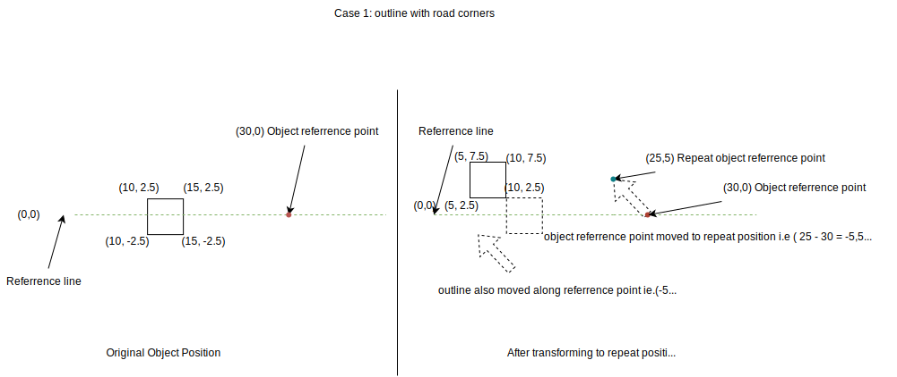
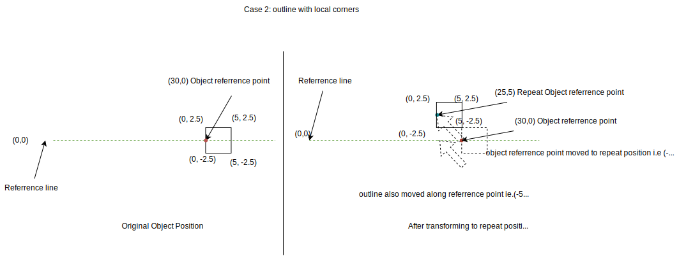
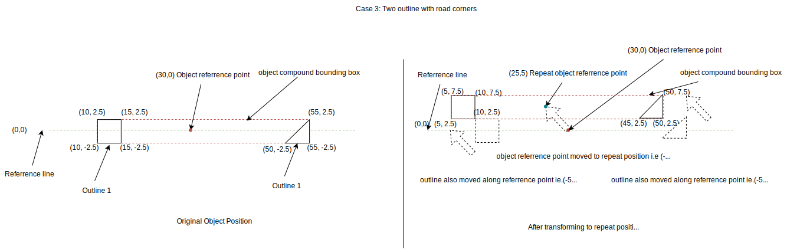
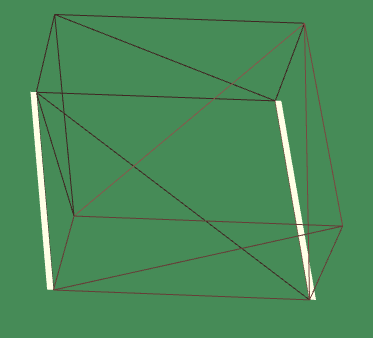
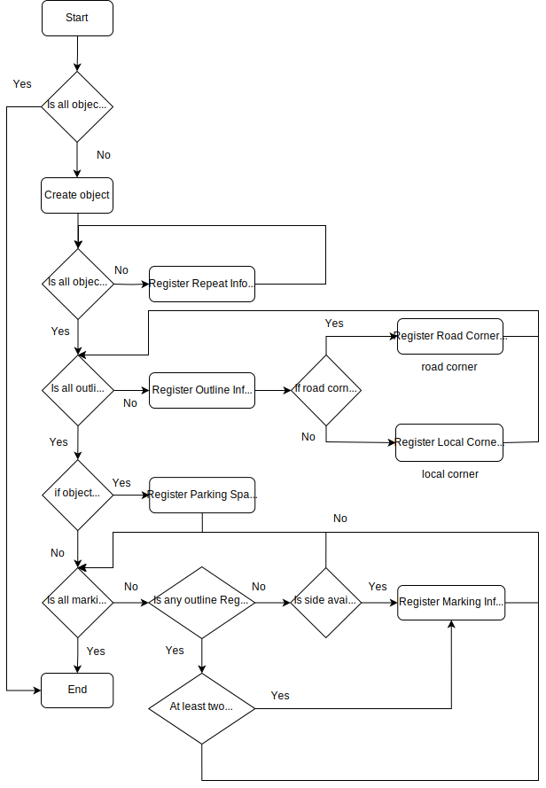

=== Stationary Objects
(framework updated in esmini v2.X)

==== The System
Objects are items that influence a road by expanding, delimiting, or supplementing its course. The most common examples are parking spaces, crosswalks, and traffic barriers. Stationary objects are specified in the https://publications.pages.asam.net/standards/ASAM_OpenDRIVE/ASAM_OpenDRIVE_Specification/latest/specification/13_objects/13_01_introduction.html[OpenDRIVE] road network description file.

There are below ways to describe the objects

- Simple bounding box : definition of the width, length and height.
- Outline with a series of corner points, including the height of the object.
- Custom 3D models

Any above object can be repeated, with option to modify shape and pose (position and orientation) of the copies. The repeat feature can be useful for things like railings and street lamps.

==== 3D Model as a stationary object

The element attribute name in the object denoates the name of the 3D model. System searches in model folder(have to add link) and use this model for viewer. The bounding box info of model shall be used only for missing bounding box info from the object. For exmaple object lenght from model bounding box shall be used if no length is provided in the object definition.

==== Releationship between object and repeat referrence point for outline
For a object the element attribute S and T are the referrence point and for the repeat the element attributes S, tStart and tEnd are the referrence point. In case object with outline, the outline shall be shifted as how repeat referrence point shifted from object referrence point. Below are the example how it handled

Case 1: outline with road corners
Typically the object reference point will be inside or on boundary of the object, In this example to make clear
Scenario:
[source,xml]
----
<object type="barrier" id="0" s="30" t="0">
    <outlines>
        <outline id="0" closed="true">
            <cornerRoad s="10" t="-2.5" dz="0.0" height="4.0" id="0"/>
            <cornerRoad s="15" t="-2.5" dz="0.0" height="4.0" id="0"/>
            <cornerRoad s="15" t="2.5" dz="0.0" height="4.0" id="2"/>
            <cornerRoad s="10" t="2.5" dz="0.0" height="4.0" id="1"/>
        </outline>
    </outlines>
    <repeat s="25" length="5" distance ="0.0" tStart="5.0" tEnd="5.0"/>
</object>
----



From the above figure, Object reference point is (30,0) and the repeat reference point is (25, 5). So the reference point is shifted by (25- 30 = -5, 5 – 0 = 5) . The outline shall also be shifted by (-5,5).

Case 2: outline with local corners
Scenario:
[source,xml]
----
<object type="barrier" id="0" s="30" t="0">
    <outlines>
        <outline id="0" closed="true">
            <cornerLocal u="0.0" v="-2.5" z="0.0" height="4.0" id="0"/>
            <cornerLocal u="5.0" v="-2.5" z="0.0" height="4.0" id="3"/>
            <cornerLocal u="5.0" v="2.5" z="0.0" height="4.0" id="2"/>
            <cornerLocal u="0.0" v="2.5" z="0.0" height="4.0" id="1"/>
        </outline>
    </outlines>
    <repeat s="25" length="5" distance ="0.0" tStart="5.0" tEnd="5.0"/>
</object>
----



From the above figure, Object reference point is (30,0) and the repeat reference point is (25, 5). So the reference point is shifted by (25- 30 = -5, 5 – 0 = 5) . The outline shall also be shifted by (-5,5).

Case 3: Two outline with road corners
Scenario:
[source,xml]
----
<object type="barrier" id="0" s="30" t="0">
    <outlines>
        <outline id="0" closed="true">
            <cornerRoad s="10" t="-2.5" dz="0.0" height="4.0" id="0"/>
            <cornerRoad s="15" t="-2.5" dz="0.0" height="4.0" id="0"/>
            <cornerRoad s="15" t="2.5" dz="0.0" height="4.0" id="2"/>
            <cornerRoad s="10" t="2.5" dz="0.0" height="4.0" id="1"/>
        </outline>
        <outline id="0" closed="true">
            <cornerRoad s="50.0" t="-2.5" z="0.0" height="4.0" id="0"/>
            <cornerRoad s="55.0" t="-2.5" z="0.0" height="4.0" id="3"/>
            <cornerRoad s="55.0" t="2.5" z="0.0" height="4.0" id="2"/>
        </outline>
    </outlines>
    <repeat s="25" length="5" distance ="0.0" tStart="5.0" tEnd="5.0"/>
</object>
----



From the above figure, Object reference point is (30,0) and the repeat reference point is (25, 5). So the reference point is shifted by (25- 30 = -5, 5 – 0 = 5) . The two outlines shall also be shifted by (-5,5). The compound bounding box info shall be used for repeat calculations like compound length.

Limitation:

- In case of multiple outlines within a single object, esmini interpretation of the OSI standard is to report each outline as a separate object. Further, each vertex (x, y value pair) will be reported as a separate base_polygon (although it would make sense to group all vertices within one base_polygon).
- For repeating objects, the next object's reference point is simply the object's length away from the previous object's reference point. This creates a consistent linear movement for straight road. For straight and curve road, In case of pervious object referrence point is in straight raod and next object referrence point may in curve raod. Length is calulated considered only pervious object referrence point curvature, As a consequence the next object referrence point simply object's length.

==== Object markings
(framework updated in esmini v2.X)

===== The System
Marking describes the road marks of any objects like crosswalks, stopping-lines, and parking spaces. Marking is defined either in accordance to the bounding box of the element or by referencing outline points of the object which are specified in https://publications.pages.asam.net/standards/ASAM_OpenDRIVE/ASAM_OpenDRIVE_Specification/latest/specification/13_objects/13_08_object_marking.html[Object marking] road network description file.

Basically markings shall be added to any type of stationary object either by mentioning side of the stationary object or by referring to the id of the outline corners.

===== Examples
**Marking mentioning side of the stationary object**

[source,xml]
----
<object type="obstacle" id="8" s="10" t="8" length="4" width="4" height="2">
    <markings>
        <marking side="right" width="0.1" color="white" zOffset="0.005" spaceLength="0.0" lineLength="1.0" startOffset="0.0" stopOffset="0.0" />
        <marking side="left" width="0.1" color="white" zOffset="0.005" spaceLength="0.0" lineLength="1.0" startOffset="0.0" stopOffset="0.0" />
    </markings>
</object>
----



**Marking mentioning by referring to the id of the outline corners**

In the following example, the side denotes the region between the specified corner reference IDs.

[source,xml]
----
<object type="crosswalk" id="3" s="10.0" t="0.0" zOffset="0.0" orientation="none" length="10.0" width="7.0" hdg="0.0" pitch="0.0" roll="0.0">
    <outlines>
        <outline id="0" closed="true">
            <cornerRoad s="52.5" t="3.5" dz="0.0" height="0.0" id="0"/>
            <cornerRoad s="52.5" t="-3.5" dz="0.0" height="0.0" id="1"/>
            <cornerRoad s="57.5" t="-3.5" dz="0.0" height="0.0" id="2"/>
            <cornerRoad s="57.5" t="3.5" dz="0.0" height="0.0" id="3"/>
        </outline>
    </outlines>
    <markings>
        <marking side="left" width="5" color="white" zOffset="0.005" spaceLength ="0.4" lineLength ="0.5" startOffset="0.5" stopOffset="0.0">
            <cornerReference id="0"/>
            <cornerReference id="1"/>
        </marking>
    </markings>
</object>
----

image::marking_ref_side.png[]

For detailed info of how objects are parsed, check the below flowchart



For detailed info of how objects are visualized, check the below flowchart

image::Object_Viewer_flowchart.svg[]

Limitation:
Corner referrence IDs are sorted in the clockwise direction. (write about the limitation)

=== Working with Draw.io XML Files in AsciiDoc

This section outlines the process for viewing, embedding, and version controlling Draw.io XML files within your AsciiDoc-based user guides.

==== Viewing Draw.io XML Files

There are three primary methods to view and edit your Draw.io XML files:

* **Desktop Application:**
    ** Install the Draw.io desktop application: https://www.drawio.com/
    ** Open the XML file using the "File" -> "Import..." menu option.

* **Online Editor:**
    ** Visit the Draw.io online editor: https://app.diagrams.net/
    ** Import the XML file using the "File" -> "Import..." menu option.

* **Visual Studio Code Extension:**
    ** Install the Draw.io Integration extension in VS Code.
    ** Create a new Draw.io file and import the XML file into it.

==== Embedding Flowcharts in User Guides

1. **Create the Flowchart:** Choose your preferred method (desktop application, online editor, or VS Code extension) to create your flowchart.
2. **Export as SVG:** Export the flowchart as an SVG image, ensuring "Include a copy of my diagram" is unchecked during export.
3. **Store SVG:** Save the exported SVG file in your `esmini binary` folder with a descriptive name.
4. **Reference in User Guide:** Use the `image` macro in your AsciiDoc document to reference the SVG file:

    ```adoc
    image::path/to/your/flowchart.svg[]

==== Version Control for Flowcharts

1. **Export as XML:** Update and export your flowchart as an XML file.
2. **Store XML:** Save the XML file in your `esmini` folder.
3. **Update User Guide:** Ensure <<Embedding Flowcharts in User Guides>> done again.
